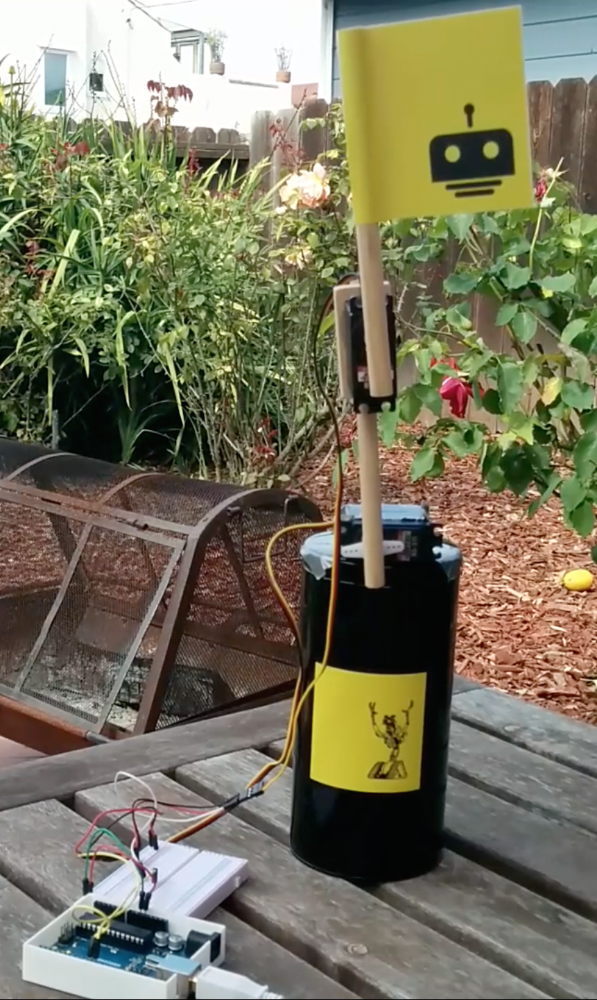

Manny the Manipulator
===

This is Manny. 



He's been to [JSConf 2013 in Amelia Island, Florida](https://speakerdeck.com/rockbot/ai-dot-js-robots-with-brains), [Web Directions Code 2014 in Melbourne, Australia](https://speakerdeck.com/rockbot/you-can-do-what-with-math-now), [Strangeloop 2015 in St. Louis, Missouri](https://www.youtube.com/watch?v=3v75aX5-gSA), and [JSConf Colombia 2015 in Medellín, Colombia (in Spanish!)](https://www.youtube.com/watch?v=Iqkm2j54Bks).

This is the code he runs on.

To run it, clone this repo and then:

```
cd manny

npm install

npm start
```

You'll need a robot attached, and can view the browser-side bits at http://localhost:3000.

Watch a video of Manny on the move: http://youtu.be/2oNqa-cL_ZQ
